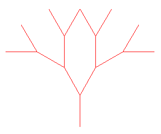
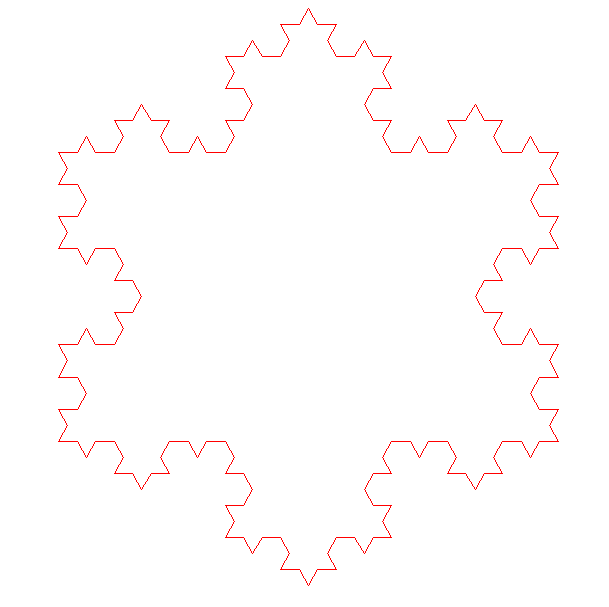
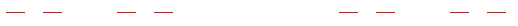

# TrutleFractal

Create a fractal using LGrammar

- initialHeading - The starting angle of the turtle
- gen - The number of generations for the program to run.
- scale - How much the fractal size scales per line to maintain the size of the whole fractal.
- windowSize - The size the fractal takes up on the screen in pixels.
- size - How much the turtle moves per line.
- axiom - The string position of the fractal.
- Lgrammar -

  - F - Turtle travels a certain distance without drawing.
  - f - Turtle travels a certain distance without drawing.
  - F, f, X, Y, U, V - Variable to be replaced with a set of commands given for deriving future generations.
    The turtle ignores this letter.
  - "\+" - Turtle turns clockwise of a certain angle
  - "\-" - Turtle turns clockwise of a certain angle

- angle - The angles to turn on a turn command

# Example L-Grammars

## Binary tree

```python
initialHeading = 90
gen = 3
scale = 1 / 2
windowSize = 500
size = windowSize * scale ** (gen)
axiom = "F"
Lgrammar = {
    "F": "F[-F][+F]",
    "f": "",
    "X": "",
    "Y": "",
    "U": "",
    "V": "",
}
angle = 30
```



## Koch curve

```python
initialHeading = 0
gen = 3
scale = 1 / 3
windowSize = 500
size = windowSize * scale ** (gen)
axiom = "F"
Lgrammar = {
    "F": "F-F++F-F",
    "f": "",
    "X": "",
    "Y": "",
    "U": "",
    "V": "",
}
angle = 60
```


## Koch snowflake

```python
initialHeading = 0
gen = 3
scale = 1 / 3
windowSize = 500
size = windowSize * scale ** (gen)
axiom = "F++F++F"
Lgrammar = {
    "F": "F-F++F-F",
    "f": "",
    "X": "",
    "Y": "",
    "U": "",
    "V": "",
}
angle = 60
```



## Quadratic Koch curve

```python
initialHeading = 0
gen = 3
scale = 1 / 4
windowSize = 500
size = windowSize * scale ** gen
axiom = "F+F+F+F"
Lgrammar = {
    "F": "F+F-F-FF+F+F-F",
    "f": "",
    "X": "",
    "Y": "",
    "U": "",
    "V": "",
}
angle = 90
```


## Hilbert curve

```python
initialHeading = 0
gen = 3
scale = 1 / 3
windowSize = 500
size = windowSize * scale ** (gen)
axiom = "X"
Lgrammar = {
    "F": "F",
    "f": "",
    "X": "-YF+XFX+FY-",
    "Y": "+XF-YFY-FX+",
    "U": "",
    "V": "",
}
angle = 90
```


## Dragon curve

```python
initialHeading = 0
gen = 3
scale = 1 / 2
windowSize = 500
size = windowSize * scale ** (gen)
axiom = "X"
Lgrammar = {
    "F": "F",
    "f": "",
    "X": "X+YF+",
    "Y": "-FX-Y",
    "U": "",
    "V": "",
}
angle = 90
```


## Gosper hexagonal curve

```python
initialHeading = 0
gen = 3
scale = 1 / 3
windowSize = 500
size = windowSize * scale ** (gen)
axiom = "XF"
Lgrammar = {
    "F": "F",
    "f": "",
    "X": "X+YF++YF-FX--FXFX-YF+",
    "Y": "-FX+YFYF++YF+FX--FX-Y",
    "U": "",
    "V": "",
}
angle = 60
```


## Sierpinski gasket

```python
initialHeading = 0
gen = 3
scale = 1 / 3
windowSize = 500
size = windowSize * scale ** (gen)
axiom = "FXF--FF--FF"
Lgrammar = {
    "F": "FF",
    "f": "",
    "X": "--FXF++FXF++FXF--",
    "Y": "",
    "U": "",
    "V": "",
}
angle = 60
```


## Sierpinski arrowhead

```python
initialHeading = 0
gen = 3
scale = 1 / 3
windowSize = 500
size = windowSize * scale ** (gen)
axiom = "YF"
Lgrammar = {
    "F": "F",
    "f": "",
    "X": "YF+XF+Y",
    "Y": "XF-YF-X",
    "U": "",
    "V": "",
}
angle = 60
```


## Branch 1

```python
initialHeading = 90
gen = 3
scale = 1 / 3
windowSize = 500
size = windowSize * scale ** (gen)
axiom = "X"
Lgrammar = {
    "F": "FF",
    "f": "",
    "X": "F[+X]F[-X]",
    "Y": "",
    "U": "",
    "V": "",
}
angle = 20
```


## Penrose Curve

```python
initialHeading = 90
gen = 3
scale = 1 / 2
windowSize = 500
size = windowSize * scale ** (gen)
axiom = "[Y]++[Y]++[Y]++[Y]++[Y]"
Lgrammar = {
    "F": "",
    "f": "",
    "X": "UF++VF----YF[-UF----XF]++",
    "Y": "+UF--VF[---XF--YF]+",
    "U": "-XF++YF[+++UF++VF]-",
    "V": "--UF++++XF[+VF++++YF]--YF",
}
angle = 36
```


## Cantor

```python
initialHeading = 0
gen = 3
scale = 1 / 3
windowSize = 500
size = windowSize * scale ** (gen)
axiom = "F"
Lgrammar = {
    "F": "FfF",
    "f": "fff",
    "X": "",
    "Y": "",
    "U": "",
    "V": "",
}
angle = 60
```


